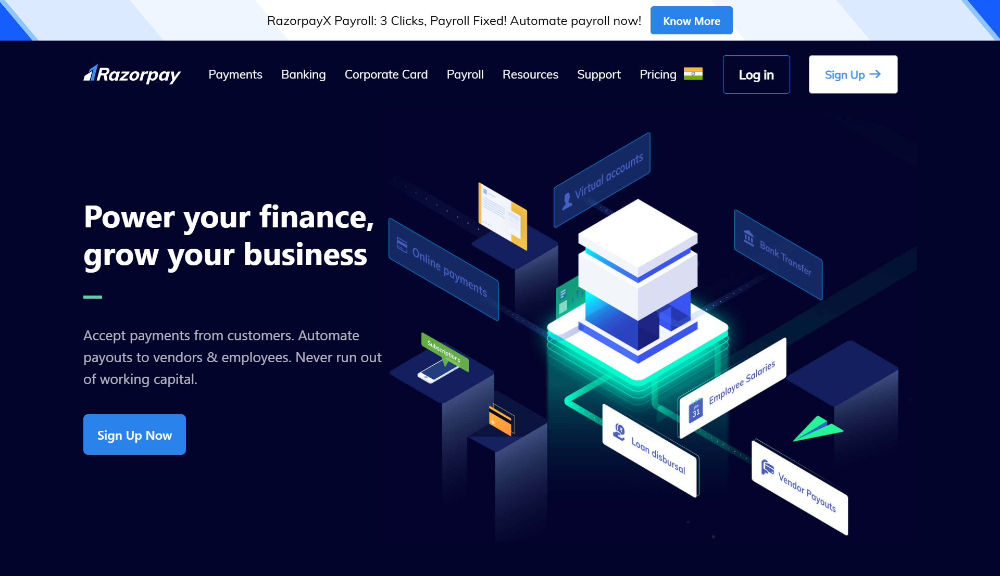

# Razorpay Website Frontend Clone

A fully responsive frontend clone of the official Razorpay website built using **React** and **Tailwind CSS**.  
This project focuses on recreating a real-world fintech landing page with clean UI, modern layouts, and scalable component architecture.

---

## 📌 Overview

This project is a **complete UI implementation** of the Razorpay website.  
It is a **frontend-only** application created for learning, practice, and portfolio demonstration.

The goal was to achieve:

- Pixel-accurate layout replication
- Production-level responsive design
- Clean and maintainable React components
- Utility-first styling using Tailwind CSS

---

## 🚀 Features

- Fully responsive design (Desktop, Tablet, Mobile)
- Modern fintech-style landing page
- Reusable React components
- Tailwind CSS utility-first styling
- Clean spacing, typography, and layout structure
- Optimized UI consistency across screen sizes

---

## 🛠 Tech Stack

- React
- Tailwind CSS
- JavaScript (ES6+)
- Vite

---

## 📁 Project Structure

```
src/
├── components/
├── pages/
├── assets/
├── App.jsx
├── main.jsx
└── index.css
```

---

## 📸 Screenshot



---

## 📱 Responsiveness

The UI is fully optimized for:

- Large screens
- Tablets
- Mobile devices

---

## ⚠️ Disclaimer

This project is created **strictly for educational and portfolio purposes**.  
All trademarks, logos, and design references belong to **Razorpay**.  
No commercial use is intended.

---

## 🎯 Purpose

- Practice real-world UI cloning
- Improve React component structuring
- Master Tailwind CSS for large layouts
- Build a strong frontend portfolio project

---

## 👤 Author

**Anil**
Frontend / Full Stack Developer Aspirant

---

## ⭐ Feedback

If you find this project useful, give it a ⭐ on GitHub.
